# Top 12 Best Caregiving Platforms Ranked in 2025 (Latest Compilation)

Finding reliable care for your kids, aging parents, or household needs shouldn't feel like searching for a needle in a haystack. Whether you're scrambling for a last-minute babysitter or seeking long-term senior companionship, the right platform connects you with vetted caregivers who actually show up and care. These platforms cut through the noise, offering background checks, community reviews, and flexible booking—so you can focus on what matters instead of endlessly scrolling through profiles.

## **[Care.com](https://www.care.com)**

The Swiss Army knife of caregiving—handles everything from toddler tantrums to senior companionship.

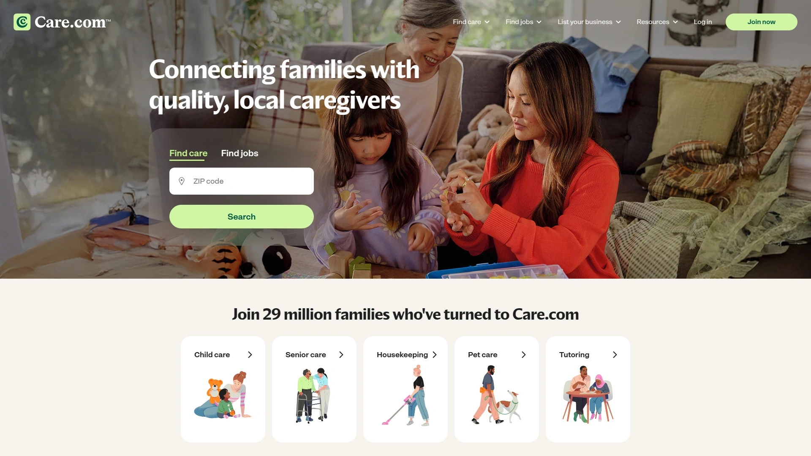

Care.com connects 29 million families with local caregivers across multiple categories including childcare, senior care, pet sitting, housekeeping, and tutoring. The platform's strength lies in its massive caregiver pool and comprehensive service range, making it particularly useful for families needing diverse care solutions under one roof.

**What makes it work:** Families create detailed job posts specifying experience requirements, location preferences, and pay rates, while caregivers apply directly. The platform offers optional enhanced background checks for additional peace of mind, though parents should note they're responsible for vetting matches independently.

**The practical side:** Premium membership runs $38.95 monthly or $156 annually and is required to message caregivers. The large candidate pool means more options but also demands more screening time to find exceptional fits. Payment and paperwork management happens outside the platform.

**Best for families** juggling multiple care needs—those who need a nanny today, a dog walker tomorrow, and occasional senior care next month appreciate the one-stop approach.

## **[UrbanSitter](https://www.urbansitter.com)**

Your neighborhood's trusted sitter network, where Facebook friends become childcare references.

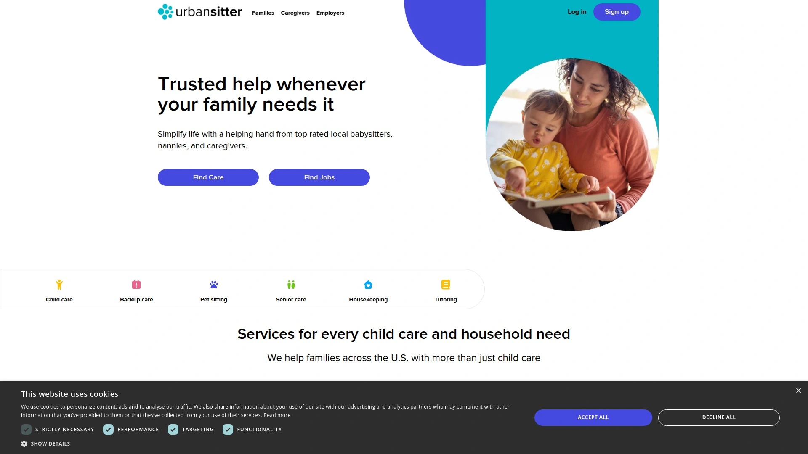

UrbanSitter leverages social connections to help parents find babysitters and nannies already trusted by people in their actual circles—school families, neighborhood groups, and local parenting communities across all 50 states. The platform stands out for its referral network spanning 300,000+ local organizations and its rapid response times.

Caregivers undergo annual background checks that exceed industry standards, with additional screening by a dedicated Trust and Safety team. Profile pages display detailed information including response times, repeat family statistics, and intro videos so parents can evaluate matches before committing.

The mobile app enables last-minute bookings in under two minutes for urgent situations, while the messaging system facilitates job detail discussions. Caregivers keep 100% of their earnings, which attracts higher-quality providers to the platform.

**Pricing structure:** Parents can browse profiles for free but need a membership to unlock booking tools. The platform offers 20% savings with value pricing on sign-ups.

## **[Sittercity](https://www.sittercity.com)**

Detailed profiles meet job-board efficiency for families who want caregivers to come to them.

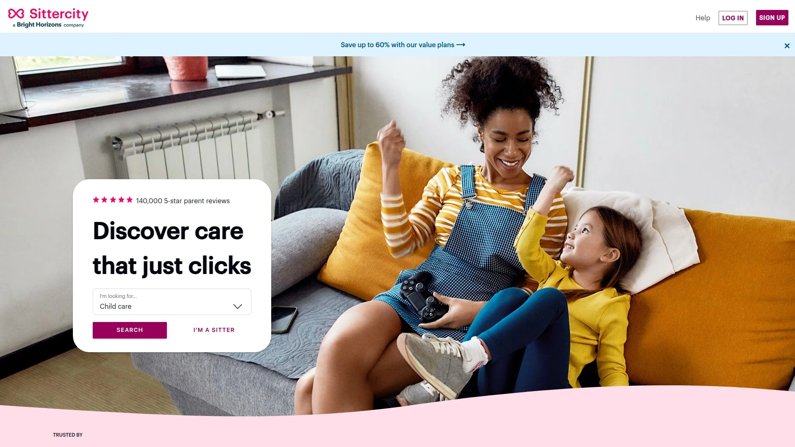

Sittercity flips the typical search process by letting parents post job listings that attract qualified sitters who apply with their credentials. The platform serves families seeking babysitters, nannies, senior care providers, and pet sitters, with 140,000+ five-star parent reviews backing its reliability.

Parents appreciate the "sitters come to you" model—create one detailed job post describing your needs, then review applications from interested caregivers showcasing their qualifications. Profile pages display certifications like CPR/First Aid, response times, last login status, experience levels, and specialized skills such as homework help or bilingual capabilities.

The platform integrates with Bright Horizons benefits programs, making it accessible for employees whose companies provide childcare benefits. Behind-the-scenes safety measures include identity verification, fraud prevention protocols, and purchasable background checks.

Members consistently praise the efficiency—families report always finding reliable sitters even in time-sensitive situations, with some using the platform for over a decade.

## **[SitterTree](https://www.sittertree.com)**

Quality-first platform that keeps the bar high and payments hassle-free.

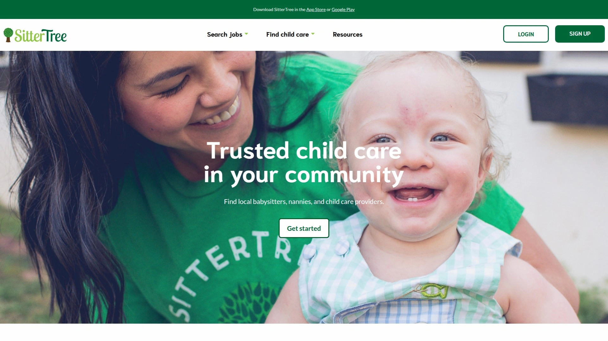

SitterTree distinguishes itself through rigorous quality standards, requiring all caregivers to maintain minimum ratings based on family feedback. The platform serves parents, preschools, and churches seeking babysitters, nannies, and childcare substitutes with proven track records.

**How it operates:** Parents post job listings and receive applications from background-checked sitters. Each caregiver profile displays certifications, experience badges (CPR training, special needs expertise), and comprehensive reviews from previous families. The in-app payment system processes transactions within 24 hours—no chasing down checks.

Babysitters appreciate the flexibility to browse and accept jobs matching their schedules while showcasing specialized skills through badge systems. The platform's support team provides responsive customer service, and unexpected tips can supplement earnings.

Churches and preschools use SitterTree for finding part-time or full-time substitutes for nurseries, toddler classes, and religious holiday coverage. Parents consistently report excellent experiences with punctual, professional sitters who engage meaningfully with children.

## **[Papa](https://www.papa.com)**

Companion care that treats seniors like family, not just another appointment.

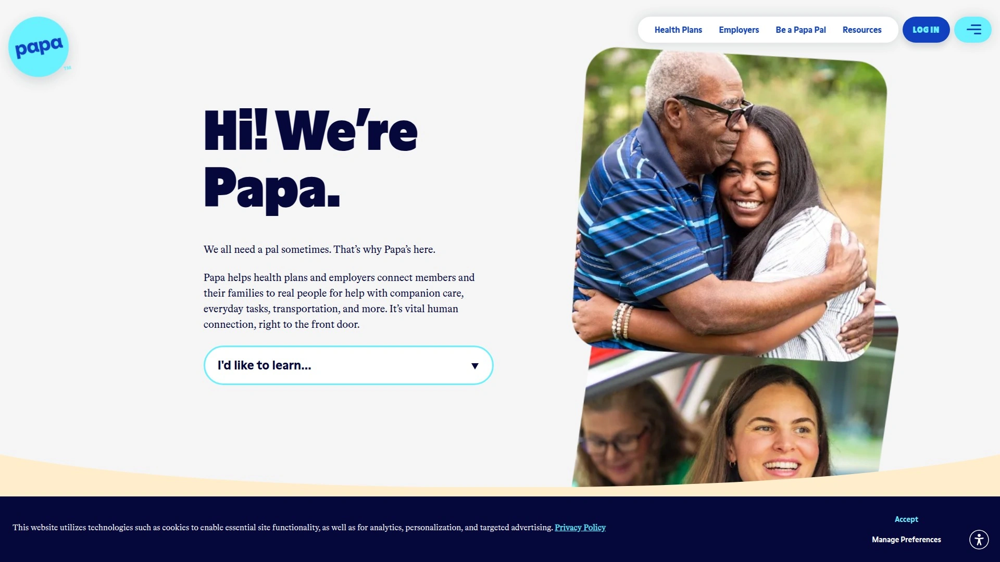

Papa connects seniors and families with "Papa Pals"—compassionate companions who provide social interaction, assistance with errands, light housekeeping, and transportation through a mobile app interface. The service addresses senior isolation while giving older adults practical support to maintain independence.

Papa Pals help seniors with technology, grocery shopping, prescription pickups, rides to appointments, and most importantly, genuine companionship. The platform is often integrated with health plans and employer benefits, making companion care accessible and affordable for members.

**What Papa Pals actually do:** Beyond basic tasks, they engage in conversations, accompany seniors on walks, help with household chores, and provide the consistent human connection that combats loneliness. Services are typically accessed through Medicare Advantage plans or employer-sponsored benefits.

The company maintains strict safety and trust standards for home healthcare, with comprehensive vetting of companions before they enter clients' homes.

## **[Helpr](https://hellohelpr.com)**

Employer-backed backup care that rescues working parents when daycare falls through.

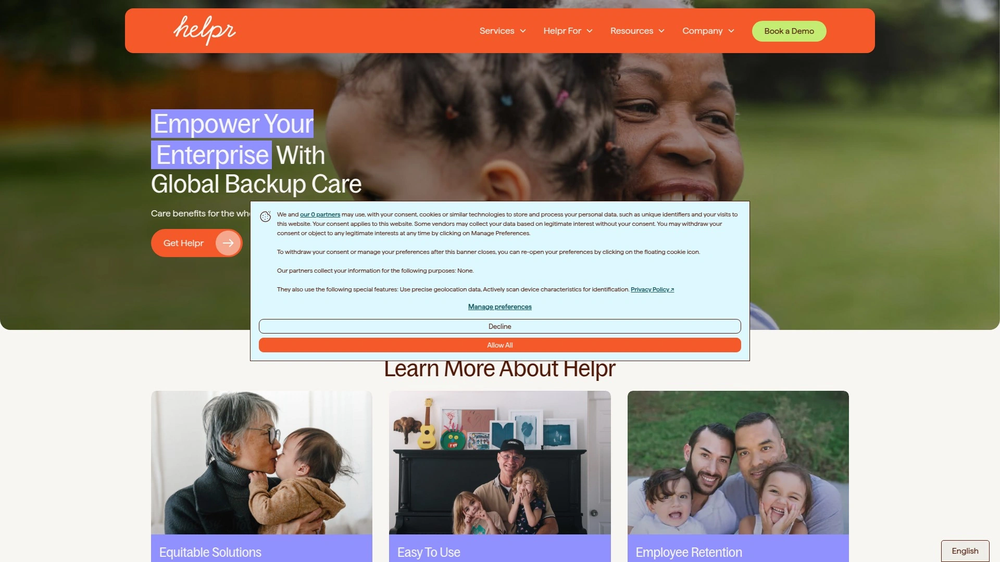

Helpr operates as an employer benefit rather than a direct-to-consumer service, providing subsidized backup care when regular arrangements suddenly collapse. The platform serves employees globally across 150+ countries, covering child care, adult dependent care, and special needs care situations.

**The genius part:** Employees can upload their own trusted caregivers—friends, family, neighbors—into the Helpr platform, then pay them using employer-provided subsidies. This "My Choice" patented technology means families aren't stuck with strangers; they can compensate their existing support network while employers fund the benefit.

How the benefit works in practice—when regular childcare falls through and you need to get to work, book your trusted caregiver through the app. The caregiver checks in when they arrive, you clock in at work, then confirm through Helpr to activate payment. Employers typically subsidize up to $13 per hour for up to 80 hours annually.

Recent platform expansions include geolocation fraud prevention, payments in local currencies, multilingual app experiences, flexible one-hour minimum bookings for short care gaps, and direct HRIS system integration.

## **[CareLinx](https://www.carelinx.com)**

Direct-hire senior care that cuts agency markup and saves families real money.

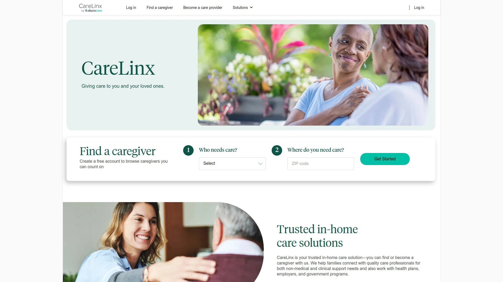

CareLinx connects families directly with professional caregivers for in-home senior care, eliminating traditional agency middlemen and reducing costs by up to 50%. The platform specializes in helping older adults age in place while maintaining independence through personalized care arrangements.

**Service categories:** Companion care includes meal preparation, shopping, transportation, laundry, and light housekeeping. Personal care services cover bathing, dressing, grooming, medication reminders, toileting, mobility assistance, and respite support.

The direct-hire model benefits everyone—families pay less while caregivers earn more, creating happier arrangements on both sides. The online technology platform handles caregiver browsing, profile comparisons, and direct hiring without agency fees stacking up.

Families create free accounts to browse experienced caregivers filtered by hourly rate, specific skills, experience levels, and user reviews. The platform provides access to thousands of vetted caregivers for reliable, high-quality care options.

## **[Bambino](https://www.bambino.com)**

Neighborhood-based sitting that keeps everything local and familiar.

Bambino focuses on connecting families with babysitters from their immediate neighborhoods, creating a familiar, community-driven childcare experience. The platform emphasizes local connections, making it more likely parents find sitters within walking distance who already know the area.

The app streamlines the booking process with quick payment options and neighborhood-specific matching. Parents appreciate working with caregivers who share their community, understand local schools and parks, and feel like natural extensions of their social circles.

Best suited for families who value hyper-local connections and prefer caregivers who might become regular fixtures in their children's lives through repeated bookings within the same neighborhood network.

## **[Nanny Lane](https://www.nannylane.com)**

Job-board approach where nannies and families find each other through detailed listings.

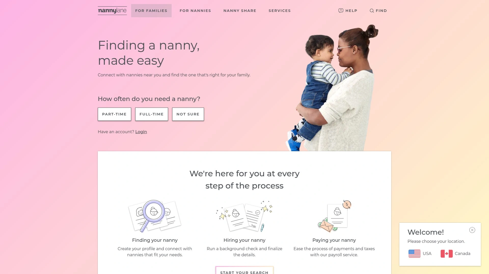

Nanny Lane operates as a job board platform connecting families directly with nannies and babysitters through posted positions and caregiver profiles. The site offers both free basic access and premium subscription options with enhanced features.

Parents post detailed job descriptions outlining their needs, schedules, and expectations, while nannies create profiles highlighting their experience, certifications, and availability. The direct-connection model works particularly well for families seeking long-term nanny placements rather than one-time babysitting.

Users report that premium subscriptions yield better results, with increased visibility and more robust matching tools compared to basic free accounts. The platform sees significant activity in major metro areas where nanny demand runs high.

## **[Thriving.ai](https://www.thriving.ai)**

Tech-enabled senior care that turns tablets into lifelines for isolated older adults.

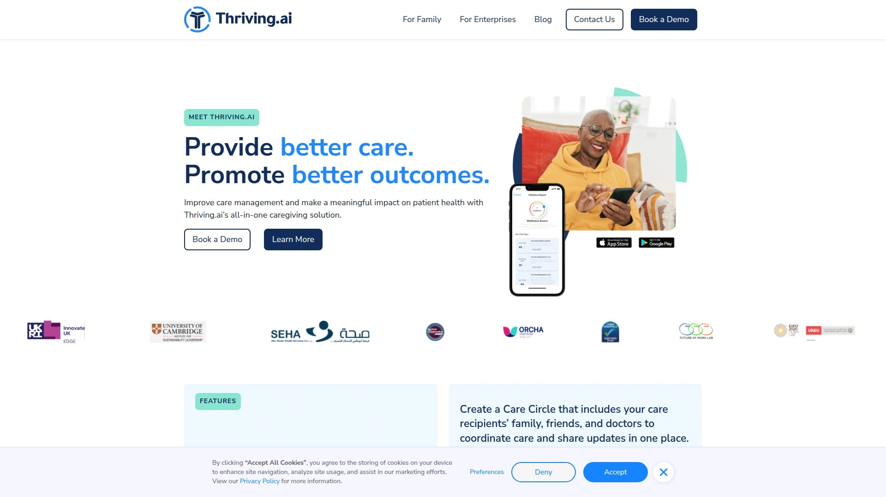

Thriving.ai provides a comprehensive digital platform connecting seniors with families and caregivers through an intuitive mobile app designed specifically for older adults. The service addresses senior isolation through technology while enabling better care coordination.

**Platform capabilities:** The app consolidates communication tools (replacing separate texting, WhatsApp, Zoom, and email threads), tracks health data from paired smartwatches and Fitbits, provides customized content feeds to combat isolation, manages shared appointment calendars, and offers the Thriving TV Channel with calming videos for dementia patients.

Premium features include comprehensive care plan development and sharing, telehealth video visits with medical professionals, and real-time mood and vitals tracking to monitor health changes. The Freemium plan provides photo sharing, learning journeys, and inspiring content at no cost.

Since 2020, hundreds of patients and caregivers have used Thriving.ai to promote healthier, more independent living. Even seniors without prior tablet experience report learning quickly and finding the platform engaging.

## **[Caring Village](https://www.caringvillage.com)**

Family coordination hub that gets everyone on the same page about elder care.

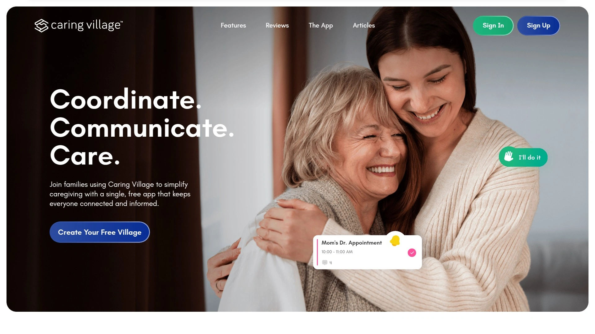

Caring Village specializes in elderly care coordination by helping caregivers manage tasks, schedules, and care plans collaboratively with family members. The app reduces caregiving stress by ensuring transparency and keeping everyone informed through shared systems.

**Core features:** A shared calendar enables family members to coordinate responsibilities and stay involved regardless of distance. Caregivers create custom care plans and securely store important health information accessible to authorized family members. The messaging system facilitates seamless communication among everyone participating in caregiving duties.

The platform proves invaluable for families balancing caregiving together—particularly when adult children live in different cities but need to coordinate parent care. Caring Village simplifies daily responsibility organization while reducing confusion about who's handling what tasks.

Must-have tool for families where multiple relatives share caregiving duties and need a central system preventing miscommunication and missed appointments.

## **[Jovie](https://www.jovie.com)**

Professional nanny service delivering consistent, reliable childcare for busy families.

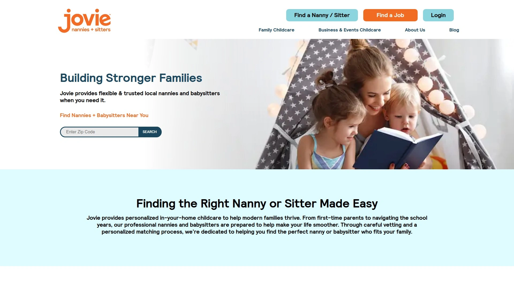

Jovie provides full-time and part-time nannies plus on-demand babysitters, helping families balance personal, professional, and family obligations through flexible childcare arrangements. The company maintains physical locations including operations in major metro areas.

The service focuses on professionalism and reliability, with rigorous caregiver vetting ensuring families receive consistent, high-quality childcare. Jovie's model suits families needing predictable schedules—parents who require the same nanny showing up every weekday morning or regular weekend coverage.

Unlike app-based platforms where families manage their own searches, Jovie handles the matching process professionally, presenting pre-screened candidates who meet specific family requirements. This concierge approach appeals to busy professionals who prefer expert guidance over DIY browsing.

## FAQ

**How quickly can I book emergency childcare?**

UrbanSitter connects families with available babysitters in under two minutes for urgent situations in most cities, while Helpr provides last-minute backup care through employer benefits with one-hour minimum bookings now available. For fastest results, maintain profiles on multiple platforms and keep preferred sitters' contact information readily accessible.

**What's the most affordable way to get senior companion care?**

CareLinx saves up to 50% compared to traditional agencies by connecting families directly with caregivers without middleman markup. Papa offers companion services through Medicare Advantage plans and health insurance benefits, while Caring Village provides free coordination tools for families managing elder care collaboratively.

**Which platform works best for finding trusted neighborhood babysitters?**

Bambino specializes in hyper-local connections within specific neighborhoods, while UrbanSitter's referral network spans 300,000+ community organizations including schools, parenting groups, and sports teams—showing you sitters already trusted by families you know. Both prioritize finding caregivers close to home who understand your community.

## Finding Care That Actually Works

The twelve platforms above cover different needs—from emergency babysitting to long-term senior companionship—but they share one goal: connecting families with caregivers they can genuinely trust. [Care.com](https://www.care.com) remains particularly valuable for households juggling multiple care categories, whether you need a nanny on Mondays, pet sitting on Thursdays, and occasional senior care help on weekends. The ability to manage diverse needs through one familiar interface saves time and reduces the mental load of coordinating separate services across multiple platforms.
